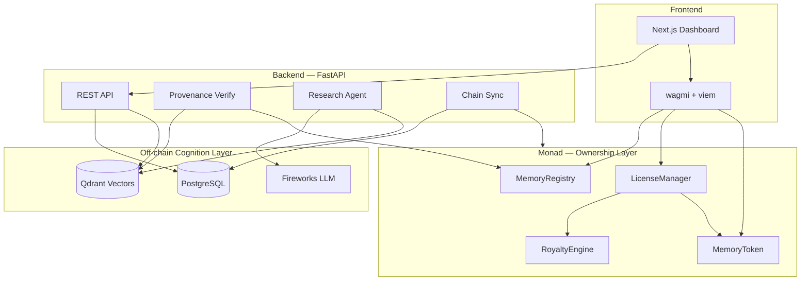

# Memoria

> **Cognition lives off-chain. Ownership lives on Monad.**

Memoria is an ownership and provenance protocol for AI memory — not an on-chain vector database. It brings Git-inspired primitives (repositories, commits, forks, lineage) to machine intelligence, with licensing and royalties built in.

**Hackathon MVP:** Deployed on **Monad mainnet (chain 143)** with a full-stack demo — research agent, two-layer provenance verification, marketplace, and royalty analytics.

---

## Table of Contents

- [What is Memoria?](#what-is-memoria)
- [Why Memoria?](#why-memoria)
- [How It Works](#how-it-works)
- [Why Monad](#why-monad)
- [What We Built](#what-we-built)
- [Architecture](#architecture)
- [Smart Contracts](#smart-contracts)
- [Quick Start](#quick-start)
- [Hackathon Demo](#hackathon-demo)
- [App Pages](#app-pages)
- [Tech Stack](#tech-stack)
- [Documentation](#documentation)
- [License](#license)

---

## What is Memoria?

AI agents accumulate valuable knowledge — research findings, debugging patterns, market intuition, personal context. Today that memory is trapped inside proprietary platforms with no ownership, no verifiable lineage, and no way to reward contributors when knowledge is reused.

**Memoria transforms AI memory from isolated data into verifiable, evolving knowledge assets.**

| Git concept | Memoria concept | On-chain entity |
|-------------|-----------------|-----------------|
| Repository | Memory Repository | `memoryId` |
| Commit | MemoryCommit | `commitHash` + lineage |
| Fork | Forked repository | `parentMemoryId` + fork point |
| Lineage | Commit DAG + fork graph | `verifyLineage()` |
| Licensing | Commercial access | `LicenseManager` |
| Upstream rewards | Royalties | `RoyaltyEngine` |

Every memory becomes a repository. Every update becomes a commit. Every derivative memory becomes a fork. Every contribution becomes traceable.

---

## Why Memoria?

### The Problem

AI systems are accumulating memory at an unprecedented rate. Research agents read papers, coding agents learn debugging patterns, trading agents develop market intuition, and personal assistants build years of contextual understanding. Yet despite their value, these memories are trapped inside proprietary platforms and isolated applications.

AI memory suffers from three fundamental problems:

#### 1. No Ownership

When an agent accumulates valuable knowledge, nobody truly owns that memory. If a platform shuts down, changes providers, or revokes access, years of accumulated intelligence can disappear overnight.

#### 2. No Provenance

Knowledge evolves through contributions, refinements, and reuse. Yet there is no reliable way to answer:

- Where did this knowledge originate?
- Which memories influenced it?
- Who contributed to its evolution?
- Can its lineage be verified?

As AI-generated knowledge becomes increasingly important, provenance becomes critical.

#### 3. No Economic Model

Knowledge creates value, but contributors are rarely rewarded when their work is reused. Open-source software solved this through version control, attribution, and collaboration. AI memory lacks an equivalent primitive.

As a result, AI memory behaves like isolated data rather than a living, evolving asset.

### Our Vision

Memoria treats memory as something that can be:

- **Owned** — on-chain repository ownership and transfer rights
- **Versioned** — commit history with cryptographic content commitments
- **Forked** — derivative repositories with preserved lineage
- **Licensed** — commercial access with programmable rules
- **Verified** — structural (on-chain) + content (off-chain) provenance
- **Monetized** — royalties flow upstream when knowledge is reused

This creates the first ownership and provenance layer for AI memory.

### Why This Is Not a Data Marketplace

A data marketplace sells files. Memoria tracks the **evolution of intelligence**.

The value of a memory repository is not simply its contents. The value comes from its history, lineage, contributors, descendants, and economic activity. Just as Git transformed source code from static files into collaborative, evolving repositories, Memoria transforms AI memory into living knowledge assets that can be forked, improved, licensed, and monetized while preserving attribution across generations.

---

## How It Works

Memoria introduces a Git-inspired architecture for AI memory with a deliberate separation of concerns:

**Cognition lives off-chain. Ownership lives on-chain.**

### On-chain (Monad — ownership & provenance layer)

- Repository ownership, transfer, and visibility (`PRIVATE` | `LICENSED` | `PUBLIC`)
- Commit hashes, content hashes, embedding hashes, and state roots
- Fork lineage and structural `verifyLineage()`
- License rules and royalty distribution (paid in **MEM** token)
- Revenue history and memory reputation scores

### Off-chain (cognition layer)

- Raw memory content and vector embeddings (Qdrant)
- Semantic search and retrieval
- LLM inference (Fireworks AI) for the research agent
- Cryptographic content verification against on-chain commitments
- Agent commit **proposals** — pending user approval before persistence

### Two-layer verification

| Layer | Where | What it proves |
|-------|-------|----------------|
| **Structural** | On-chain `verifyLineage()` | Repository ancestry, fork links, commit parent chain |
| **Content** | Backend `/provenance/verify` | Recomputed hashes match on-chain commitments |

This separation combines the scalability of modern AI infrastructure with the trust guarantees of blockchain — without putting vectors or raw content on-chain.

### Agent flow

```
User question → Agent proposes memory → User approves → Commit recorded → Sync to Monad
```

The research agent **never auto-persists**. Every memory update requires explicit human approval, then registers on-chain with full provenance.

---

## Why Monad

Memoria requires a blockchain that can support **continuously evolving digital assets**.

Traditional on-chain apps manage static assets — tokens, NFTs, governance positions. Memoria is different: every repository evolves over time. Every approved memory update creates a new commit, provenance record, cryptographic commitment, and ownership state. As AI adoption grows, these updates can occur continuously across thousands of repositories.

Monad's high-throughput EVM architecture enables memory repositories to evolve in real time while maintaining verifiable ownership, trustless provenance, licensing infrastructure, royalty distribution, and repository lineage.

Memoria is not simply deployed on Monad — it uses Monad as the **ownership layer for continuously evolving AI assets**.

---

## What We Built

This hackathon MVP delivers an end-to-end ownership and provenance stack:

- **Smart contracts** — `MemoryRegistry`, `LicenseManager`, `RoyaltyEngine`, `MemoryToken` (MEM), `MemoryScoreRegistry`
- **Backend API** — FastAPI with PostgreSQL, Qdrant vector store, canonical hashing, chain sync worker
- **Research agent** — Fireworks-powered propose → approve → commit workflow
- **Web dashboard** — Next.js + wagmi on Monad mainnet; marketplace, lineage DAG, provenance tab, analytics
- **Hackathon demo flow** — One-click walkthrough: license parent repo → fork → extend → license child → parent earns royalty

---

## Architecture



See [docs/architecture.md](docs/architecture.md) and [docs/contract-architecture.md](docs/contract-architecture.md) for full details.

---

## Smart Contracts

Deployed on **Monad mainnet (chain 143)**:

| Contract | Address |
|----------|---------|
| MemoryToken (MEM) | `0xA496BEc7E101734e8B65D0d7FE0f37627bb576D2` |
| MemoryRegistry | `0xCAf14d24bfcFBb407B3D6ab07DE96C0CC06AaEEd` |
| LicenseManager | `0xB25119cA8e93AC60765064F0F017F7C6088f6E1a` |
| RoyaltyEngine | `0xdFaE7164d4bbA8C808285705DB8e7a547496E7FB` |
| MemoryScoreRegistry | `0xA6a61E56660f4b3fB042845c8D7A845f30fA7e4c` |

To redeploy locally, see [Contracts](#contracts-foundry) below.

---

## Quick Start

### Prerequisites

- Docker & Docker Compose
- Node.js 20+
- Python 3.11+
- [Foundry](https://book.getfoundry.sh/) (for contracts only)
- Fireworks API key (for agent + embeddings)
- Monad wallet with MON for gas

### 1. Configure environment

```bash
cp .env.example .env
cp .env.example web/.env.local   # or symlink; Next.js reads web/.env.local
```

Fill in:

- `FIREWORKS_API_KEY` — for LLM and embeddings
- `PRIVATE_KEY` — backend signer (must match wallet that owns repos you sync on-chain)
- Contract addresses — use deployed addresses above, or redeploy and update

Set `NEXT_PUBLIC_*` contract addresses in `web/.env.local` to match.

### 2. Start infrastructure

```bash
docker-compose up -d postgres qdrant
```

Or run the full stack (backend + web in Docker):

```bash
docker-compose up -d
```

### 3. Backend

```bash
cd backend
pip install -r requirements.txt
uvicorn app.main:app --reload
```

API runs at `http://localhost:8000`.

### 4. Frontend

```bash
cd web
npm install
npm run dev
```

App runs at `http://localhost:3000`. Connect a wallet on **Monad mainnet (chain 143)**.

### Contracts (Foundry)

Run from the `contracts/` directory:

```bash
cd contracts
forge install --no-git foundry-rs/forge-std
forge install --no-git OpenZeppelin/openzeppelin-contracts
forge test
forge script script/Deploy.s.sol --rpc-url https://rpc.monad.xyz --broadcast
```

Update `.env` and `web/.env.local` with the new addresses after deploy.

---

## Hackathon Demo

The fastest way to see Memoria end-to-end is the guided demo flow.

### Option A — One-click demo (recommended)

1. Set `ENABLE_DEMO_FLOW=true` in `.env` and `NEXT_PUBLIC_ENABLE_DEMO_FLOW=true` in `web/.env.local`
2. Start backend + frontend (see Quick Start)
3. Open **`http://localhost:3000/demo`**
4. Run the guided flow — it executes on-chain:
   - Create a LICENSED parent repository
   - Buyer purchases a license (100 MEM)
   - Forker forks and extends the memory
   - Buyer licenses the fork
   - Parent earns upstream royalty (5%)

### Option B — Manual walkthrough

```bash
bash scripts/demo.sh
```

Or follow these steps:

1. **`/agent`** — Connect wallet, create a LICENSED repository, ask a question, approve the proposal, register on mainnet
2. **`/repositories/[id]`** — View commits, lineage DAG, and run structural + content provenance verification
3. **`/marketplace`** — Browse repositories and Knowledge Revenue rankings
4. **`/analytics`** — View royalty revenue and license activity

Optional seed data for marketplace browsing:

```bash
python scripts/seed_demo.py
```

### Demo narrative

> A quant research agent accumulates market insights. Those insights are committed to a LICENSED repository on Monad. A researcher forks the repo, extends it with risk models, and sells access. When someone licenses the fork, the original contributor earns royalties — provenance and economics preserved across generations.

---

## App Pages

| Route | Description |
|-------|-------------|
| `/` | Dashboard — owned repos, active licenses, royalty revenue |
| `/marketplace` | Browse memory repositories + Knowledge Revenue rankings |
| `/repositories/[id]` | Commits, lineage DAG, provenance verification, licensing |
| `/agent` | Research agent — propose → approve → commit → sync on-chain |
| `/analytics` | Royalty analytics and revenue history |
| `/demo` | Guided hackathon demo flow (when enabled) |

---

## Tech Stack

| Layer | Technology |
|-------|------------|
| Blockchain | Monad (EVM), Foundry, OpenZeppelin |
| Frontend | Next.js, shadcn/ui, wagmi, viem, React Flow |
| Backend | FastAPI, SQLAlchemy, async PostgreSQL |
| Vectors | Qdrant |
| AI | Fireworks (DeepSeek chat + Qwen3 embeddings) |
| Infra | Docker Compose |

---

## Documentation

- [Architecture](docs/architecture.md) — trust boundaries, agent flow, HEAD semantics
- [Contract architecture](docs/contract-architecture.md) — deploy order, events, verification
- [Canonical hashing](docs/canonical-hashing.md) — content hash specification for provenance

---

## Why It Matters

The future will not be defined by AI models alone — it will be defined by the **memories those models accumulate**. As AI systems become autonomous participants in research, engineering, finance, and science, memory itself becomes a valuable digital asset.

Memoria provides the infrastructure to own, verify, and monetize that asset. Just as Git became the foundation for collaborative software development, Memoria aims to become the foundation for collaborative machine intelligence.

---

## License

MIT
